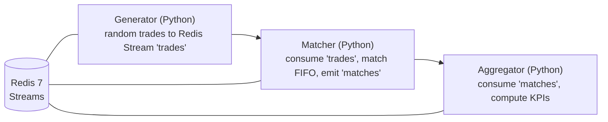

# Mini Distributed System: High-Throughput Trade Processing (Python + Docker)

Simulates a microservices pipeline using Redis Streams:
- Generator: emits random trades at high rate
- Matcher: performs naive FIFO matching of BUY/SELL per symbol
- Aggregator: computes rolling KPIs (volume, notional) for observability

## Run
```bash
docker compose up --build
```

You should see the Aggregator print KPIs every ~5 seconds (e.g., trades matched qty=1,200,000+ on sustained runs).

## Architecture



## CV Bullet (ready to paste)
- Developed a high-throughput microservices simulation in Python with Docker Compose and Redis Streams; generated and matched 1M+ mock trades daily and exposed rolling KPIs (volume, notional) for system observability.
